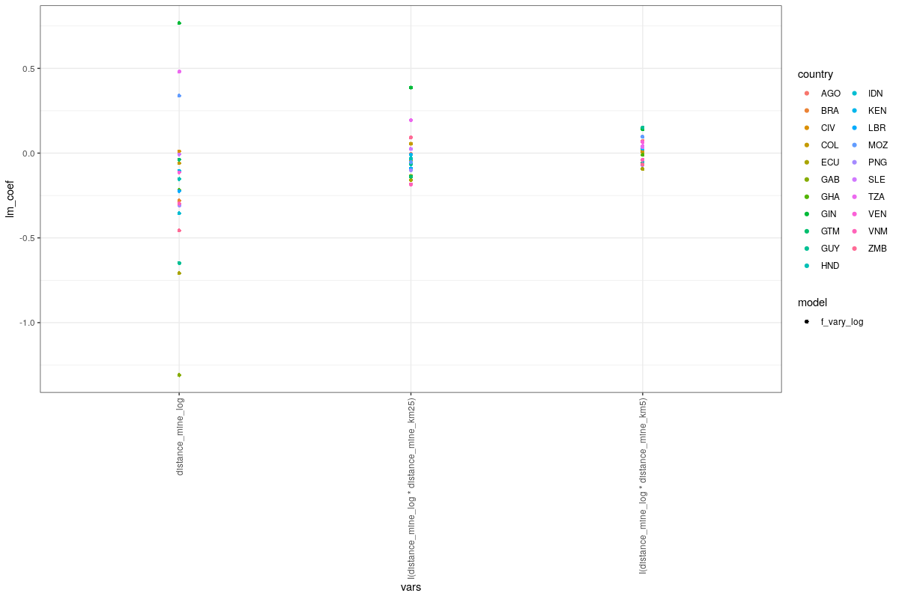
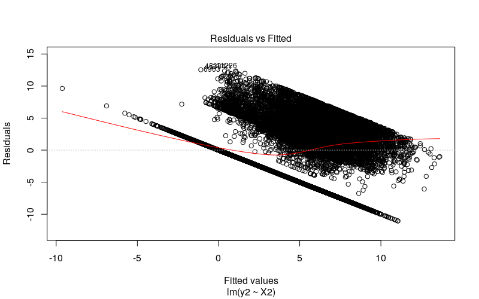
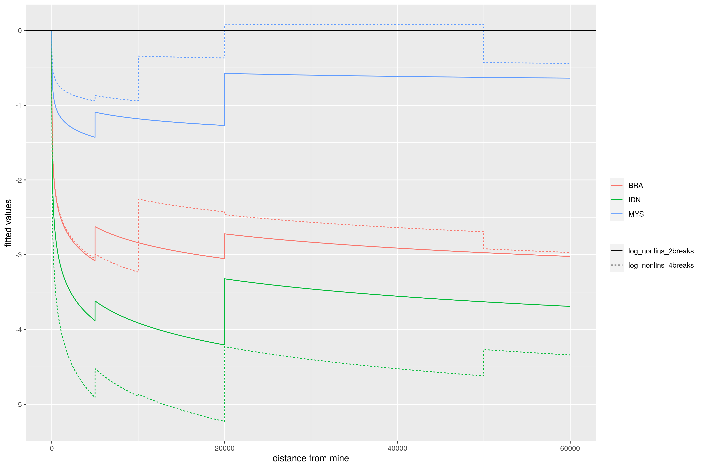
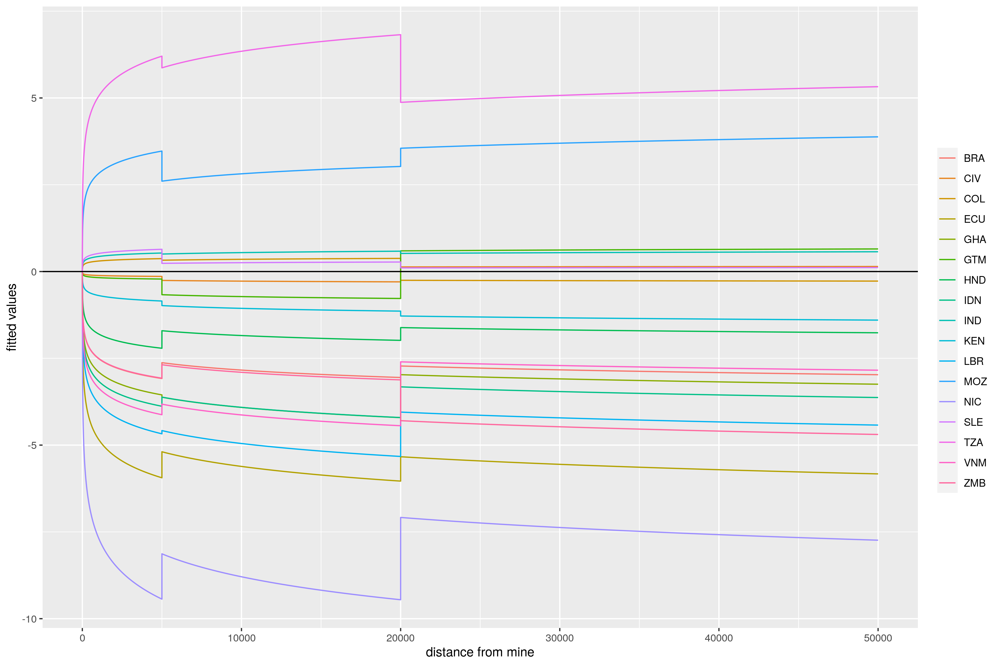
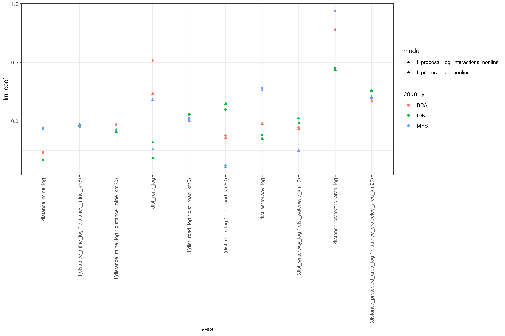
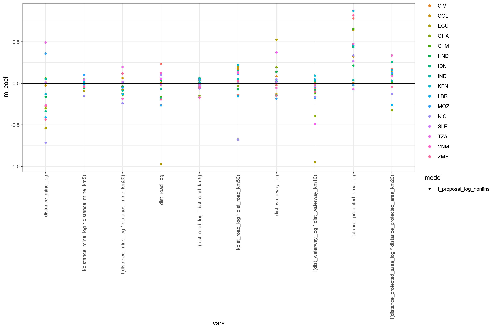

# 2020-08-11

## Modell

Das Biome ist als zusätzliche Explanatory dabei (mit wenig Effekt). Für mehr Detail könnte man stattdessen die Ecoregions heranziehen. Ansonsten ist die `distance_mine` relativ simpel gelogged, mit 5km und 25km Interaktion. Die restlichen Distanzen bekommen die vollen 5/10/25/50km Interaktionen. Auch wenn es vielleicht im Modell nicht besonders wichtig war, würd ich'S doch definitiv erwägen die Booleans trotzdem einzubauen (v.a. etwa bei protected areas).
Zusätzlich läuft es jetzt nochmal ohne Straßen und ohne protected areas als robustness check.

Erwartungsgemäß haben wir die größten Outlier-Probleme bei bewaldeten Regionen ganz ohne Abholzung. Da ist die Frage wie das in unserem Modell am besten addressierbar ist. Eventuell two-stage, also binomial und dann linear/count oder censored regression? Auf Basis der Residuen ist das fast zwingend notwendig.

## Ergebnisse

Die Ergebnisse scheinen weiterhin robust. Allerdings ist Heteroskedastizität ein given und bei den Residuen fällt das Problem mit 0 Abholzung stark auf. Dadurch wird dann auch die tatsächliche Abholzung unterschätzt.

# 2020-08-06

## Ergebnisse

Darstellung der Ergebnisse in Form von fitted values. Log Modell impliziert logarithmische Kurven, Interaktionen mit Distanzdummies implizieren Sprünge in den Kurven.

#### BIM, 2 Modellvarianten (2 bzw. 4 Interaktionen):

Vielleicht wäre es doch schlauer für mehr als 2 Brüche zu erlauben?

#### Alle Länder, 2 Interaktionen

# 2020-08-04

## Modell

Log-log Spezifikation

2 Modelle: a) ohne weitere Interaktionen wie etwa Elevation * Slope und b) inkl. weitere Interaktionen zwischen den einzelnen Variablen

Nichtlinearitäten: Einsatz von Dummyvariablen, ob Observationen innerhalb einer festgelegten Distanz liegen. Diese werden für Interaktionsterme mit den (log)Distamzvariablen verwendet.

Achtung: e.g. <5km war bisher mit FALSE kodiert, wenn eine Observation innerhalb 5km liegt (was unintuitiv ist), habe das zur besseren Interpretation auf >= 5km, >= 10km usw. in `add_vars()` geändert.

On-site bool wurde exkludiert, da die Koeffizienten kaum reagieren, wenn andere Interaktionsdummies verwendet werden (Effekt wird vermutlich hauptsächlich von 5km Dummy eingefangen).

Welche Distanzen zeigen signifikante Brüche? Explorativer Prozess anhand BRA, IDN und MYS (siehe Ergebnisse). Davon lassen sich folgende vorgeschlagene Distanzen ableiten:
- Distance Mine Dummies für 5 und 20km
- Road Dummy für 5 und 50km
- Waterway Dummy für 10km
- Protected Area Dummy für 20km
- Cropland Dummy für 10km

## Ergebnisse

#### Explorativ: Log-log + Interaktionen aller Distanzvariablen mit 5, 10, 20 und 50km Dummies

Distance Mine:

- BRA: Signifikant negativer Koeffizient bei distance_mine_log * distance_mine_km10 (i.e. innerhalb 10km gibt es schwächere Abholzungseffekte)
- MYS: Signifikant negativer Koeffizient bei distance_mine_log * distance_mine_km10 und km20, positiver Koeffizient bei distance_mine_log * distance_mine_km50
- IDN: Signifikant negativer Koeffizient bei distance_mine_log * distance_mine_km5 und km20, und km50

Distance Road:

- BRA: Signifikant negativer Koeffizient bei dist_road_log * dist_road_km50 (i.e. außerhalb 50km gibt es schwächere Abholzungseffekte), leicht positiv bei km5
- MYS: Signifikant negativer Koeffizient bei dist_road_log * dist_road_km20 und km50, auch leicht positiv bei km5
- IDN: Signifikant positiver Koeffizient bei dist_road_log * dist_road_km10 und km50, leicht positiv bei km5 und 20

Distance Waterway:

- BRA: Signifikant negativer Koeffizient bei dist_waterway_log * dist_road_km5 und km10, positiv bei km50
- MYS: Signifikant negativer Koeffizient bei dist_waterway_log * dist_road_km5 und km10, positiv bei km20, kein Koeffizient für 50 (vermutlich aufgrund mangelnder Observationen)
- IDN: Signifikant negativer Koeffizient bei dist_waterway_log * dist_road_km10, positiv bei km5 und km20, kein Koeffizient für 50 (vermutlich aufgrund mangelnder Observationen)

Distance Protected Area:

- BRA: Signifikant schwach negativer Koeffizient bei distance_protected_area_log * distance_protected_area_km5 und km10, schwach positiver Koeffizient bei distance_protected_area_log * distance_protected_area_km20 und km50
- MYS: Signifikant positiver Koeffizient bei distance_protected_area_log * distance_protected_area_km20
- IDN: Signifikant positiver Koeffizient bei distance_protected_area_log * distance_protected_area_km5, km20 und km50

Distance Cropland:

- BRA: Signifikant positiver Koeffizient bei distance_cropland_2000_log * distance_cropland_2000_km5, km10 und km20
- MYS: Leicht negative Effekte für alle Kategorien
- IDN: Signifikant positiver Koeffizient bei distance_cropland_2000_log * distance_cropland_2000_km5 und km10

#### Erstes Proposal (log-log, keine on-site Dummies, ausgewählte Distanzinteraktionen):

#### Erstes Proposal, alle Länder:

Hier wird nur das Modell ohne zusätzliche Interaktionen wie etwa Elevation * Slope gezeigt, da das Interaktionsmodell kaum veränderte Koeffizienten und minimal bessererem Fit zeigt.

# 2020-08-03

## Ergebnisse

#### Allgemein

Für einige Länder haben wir sehr niedrigen Fit:

- AGO < 0.05
- COG, GAB, GUY, SUR < 0.10

Das Matching ist bei folgenden Ländern interessant:

- MDG behält 8,005 von 566k Observationen (3,157 treated & 4,848 untreated)
- LAO behält 12,732 von 284k Observationen (5,489 treated & 7,243 untreated)
- KEN behält 2,489 von 664k Observationen (1,100 treated & 1,389 untreated)
- HND behält 2,437 von 131k Observationen (1,217 treated & 1,220 untreated)
- GTM behält 4,950 von 127k Observationen (2,114 treated & 2,836 untreated)
- ECU behält 4,935 von 262k Observationen (1,970 treated & 2,965 untreated)
- GAB behält 3,556 von 303k Observationen (1,550 treated & 2,006 untreated)

#### Mining

Für folgenden Länder verhalten sich die Koeffizienten robust wie erwartet:

AGO, BFA, BRA, COL, ECU, GAB, GHA, GUY, HND, IDN, KEN, LBR, MDG, PNG, SLE, SUR, ZMB

Für folgende finden wir robust positive Koeffizienten:

CHN, CIV, GIN, LAO, MOZ, THA, TZA

Für folgende sind die Ergebnisse gemischt:

GTM, MYS, PER, PHL, VEN, VNM

# 2020-07-30

## Modell

Log-log Spezifikation sollte am meisten Sinn ergeben - möglicherweise mit on-site und/oder weiteren Dummies (+ Interaktion?). Distance decay verhält sich (mit 0.5 Parameter) sehr ähnlich, fittet aber nicht so gut. Lineare explanatories sind teils auch ähnlich, aber fitten schlechter und die Linearität ist zweifelhaft.

Ein kurzer Vergleich von Log- und Level-dependent würde Sinn machen.
Heteroskedastizität ist vermutlich ein Problem (laut Breusch-Pagan).
Für Brasilien finden wir ~vier Observationen mit hohem Leverage die mehr Aufmerksamkeit verdienen.
Diagnostics müssten wir generell genauer etwas genauer inspizieren.

## Ergebnisse

Für folgende Länder gibt es zurzeit erste Ergebnisse (mit unterschiedlichem Detail): BRA, IDN, MYS, AGO, COL, LAO, VNM, SUR.

#### Log-Linear
Wir finden abnehmenden Forest Loss mit linear steigender Distanz für: BRA, IDN, MYS, AGO, COL, VNM, SUR. Ein Dummy für 5km Umkreis scheint sinnvoll zu sein, aber verändert die Ergebniss nur unbedeutend. Eine Ausnahme ist SUR, wo dann nur dieser relevant ist -- der Effekt auf Abholzung findet nur im direkten Umfeld statt.
LAO reißt hier aus, und zeigt sinkende Abholzung bei steigender Distanz.

#### Log-log
Ergebnisse bei der logarithmisch steigender Distanz sind etwas gemischter -- wir finden abnehmenden Forest Loss für: BRA, IDN, AGO, COL, SUR. In MYS und VNM ist der Koeffizient nahe bei 0 und nicht sehr robust; bei LAO finden wir steigenden Forest Loss (wie zuvor). Auch hier ist der 5km Dummy relevant, mit tendenziell höherem Einfluss.
Die Ergebnisse sind robust gegenüber dem Auslassen von Population, Land Use, Land Use Gruppen, und Protected Areas -- MYS ist hier die Ausnahme.

#### Ausmaß

In der log-log Spezifikation für Brasilien erhalten wir u.a. folgende Koeffizienten:

distance-mine < 5km: 1.21
distance-mine log: -0.3
population log: 0.95
forest-area log: 0.57
distance-road < 5km: -0.52
distance-road log: 0.28
distance-protected-area < 5km: 0.19
distance-protected-area log: 0.18
distance-cropland < 5km: -0.18
distance-cropland log: -1.58

Ein 1% increase in Distance führt also zu einem 0.3% decrease in Loss. Im direkten Umfeld ist der Loss nochmal 1.21% höher.
Distanz zur Mine spielt auch allein (d.h. mit fix-gehaltenen Distanzen zu Infrastruktur, protected areas und Cropland) eine Rolle.
Der Effekt von Forest Area ist vermutlich absolut der relevanteste (und vll als Variation des konstanten Effekts zu sehen). Population und Croplands spielen außerdem eine wichtige Rolle. Protected Areas scheinen zu funktionieren, wobei das direkte Umfeld (inklusive selbst) höhere Loss-Raten erfahren. Wegen der zeitlichen Komponente ist die Variable allerdings äußerst fragwürdig (zB könnte Loss zu Protected Areas führen). Interessanterweise hat die Distanz zu Straßen einen positiven Koeffizienten -- wohlgemerkt wäre das der Effekt bei konstanter Distanz zu ua Minen und Croplands.

## Länder

Die Liste der Länder ist weiter gekürzt, u.a. auf Grund von mangelnden Minen-Daten oder mangelndem Wald. Die verbliebenen Länder sind weiterhin nicht komplett einwandfrei:

- Burma wird dominiert von Minen in Indien und China, national gibt es nur eine zentrale Mine.
- Thailand ist im Norden und im Süden sehr bewaldet - nur im Norden gibt es nationale Minen, im Süden dominiert Malaysia.
- Malaysia hat nur eine (zentrale) Mine auf Borneo - die Insel unterscheidet sich stark von der Halbinsel.
- Einige der Länder sind relativ klein, haben wenige Minen oder sehr konzentrierte Cluster.
